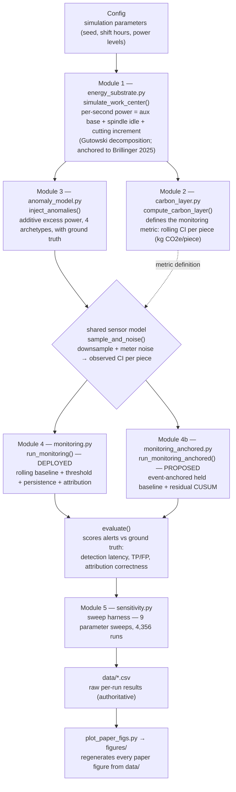

# Architecture

This document describes how `cimonitoring` is structured and how data flows through it. It is intended for contributors and anyone who wants to understand, extend, or audit the framework.

The system is a **layered simulation pipeline**: each stage produces a `pandas.DataFrame` that the next stage consumes, so any stage can be inspected, swapped, or re-run in isolation. The same energy signal is fed to two interchangeable detection layers (the deployed adaptive-baseline detector and the proposed event-anchored detector), which makes head-to-head comparison a controlled experiment rather than two separate runs.

## Data flow



The key design property is the **shared sensor stage**: `sample_and_noise()` lives in Module 4 and is reused unchanged by Module 4b. Both detectors therefore see the *identical* observed signal, so any difference in detection performance is attributable to the detection logic alone.

## Components

| Layer | File | Responsibility | Key public API |
|---|---|---|---|
| Module 1 — Energy substrate | `energy_substrate.py` | Generate a per-second power time series for one work center: auxiliary base load + spindle no-load + cutting increment (engaged only while cutting). Structure follows Gutowski et al. (2006); parameters carry provenance tags and the no-load spindle range is anchored to the Brillinger et al. (2025) CNC dataset. | `Config`, `simulate_work_center()` |
| Module 2 — Carbon layer | `carbon_layer.py` | Layer emissions and carbon intensity on the energy substrate. Defines the central monitoring signal — **rolling CI per piece** (kg CO₂e/piece) — which rises when energy climbs but output does not. | `CarbonConfig`, `compute_carbon_layer()`, `grid_emission_factor()` |
| Module 3 — Anomaly model | `anomaly_model.py` | Inject parametrized faults as additive excess power with no extra output, recording exact onset/magnitude/duration as **ground truth**. Four literature/data-grounded archetypes. | `AnomalyConfig`, `AnomalySpec`, `inject_anomalies()`, `compressed_air_leak`, `machine_left_on`, `tool_wear`, `coolant_pump_fault` |
| Module 4 — Monitoring (deployed) | `monitoring.py` | Model what an MES/SCADA system actually sees (downsampled, noisy), then run the deployed detector: rolling baseline + threshold (absolute / relative / statistical) + tiered persistence (warning/critical) + component attribution. Includes the evaluation scorer. | `MonitorConfig`, `run_monitoring()`, `sample_and_noise()`, `detect()`, `attribute()`, `evaluate()` |
| Module 4b — Monitoring (proposed) | `monitoring_anchored.py` | The proposed detector that closes the adaptive-baseline inertia blind spot: an **event-anchored held baseline** plus a **residual CUSUM** on the dimensionless fractional residual, with health-gated anchoring. Reuses Module 4's sensor model for a controlled comparison. | `AnchoredMonitorConfig`, `run_monitoring_anchored()`, `detect_anchored()`, `held_baseline()` |
| Module 5 — Sensitivity harness | `sensitivity.py` | Orchestrate the substrate → anomaly → monitor → evaluate pipeline across parameter sweeps; aggregate outcome metrics; write raw per-run results to CSV. No tuning to targets — the contribution is the characterization. | sweep functions (run via `__main__`) |
| Reproduction | `plot_paper_figs.py` | Regenerate every reported figure purely from the released CSVs in `data/` (no simulation modules required). | — |

## Detection layers in detail

Both detectors consume the same observed CI-per-piece signal and emit a tiered alert level (none / warning / critical) plus an attribution.

**Module 4 (deployed).** Compares the signal to a *rolling* baseline. Three threshold families are selectable and swept: `absolute` (fixed limit), `relative` (default; `CI > (1+r)·baseline`), and `statistical` (`CI > mean + k·σ`). A persistence requirement (N consecutive samples) suppresses transients, tiered as warning-after-W / critical-after-C. Its structural limitation — characterized in the base study — is **inertia**: a fault that develops on a timescale comparable to the baseline window is tracked by the baseline and never crosses threshold.

**Module 4b (proposed).** Replaces the tracking reference with two literature-grounded mechanisms:

1. **Event-anchored held baseline** — the baseline is estimated over a short window just after a discrete MES "known-healthy" event (shift start after maintenance, operator-confirmed state, tool-change from the NC program) and **held constant** until the next anchor. Slow drift then accumulates against a stationary reference instead of disappearing into a moving one. (`anchor_mode`: `shift_start` / `periodic` / `periodic_gated`.)
2. **Residual CUSUM** — a one-sided cumulative-sum test on the *fractional* residual `e_t = (CI_t − B_anchor) / B_anchor`, with dimensionless slack `k` and decision interval `h`. CUSUM is near-optimal for small persistent shifts (Page 1954; Lorden 1971) — exactly the regime where the deployed rule is weakest.

Selectable via `AnchoredMonitorConfig.detector`: `anchored_threshold` (D1) or `anchored_cusum` (D2).

## Repository layout

```
.
├── cimonitoring/             installable package (the engine)
│   ├── energy_substrate.py   Module 1
│   ├── carbon_layer.py       Module 2
│   ├── anomaly_model.py      Module 3
│   ├── monitoring.py         Module 4  (deployed detector + sensor model + evaluate)
│   ├── monitoring_anchored.py Module 4b (proposed detector)
│   └── sensitivity.py        Module 5  (sweep harness)
├── plot_paper_figs.py        figure reproduction from data/
├── data/                     4,356 raw per-run results across 9 sweeps
├── figures/                  generated figures
├── docs/parameter_provenance.md   [ANCHORED]/[LITERATURE]/[ASSUMPTION] table
├── notebooks/quickstart.ipynb     zero-setup Colab demo
├── tests/test_all.py         end-to-end test suite (run under CI)
├── paper2_anchored_detector/ Paper 2 evaluation scripts + a synced copy of the engine
├── pyproject.toml            package metadata
└── .github/workflows/tests.yml  CI on Python 3.9 / 3.11 / 3.12
```

## Cross-cutting design decisions

- **Layered DataFrames, single direction of flow.** Each module takes a DataFrame and returns an enriched one. Stages are independently inspectable and testable, and there is no hidden shared state between them.
- **Ground truth by construction.** Because faults are injected by Module 3, the exact onset/magnitude/duration are known, so every alert can be scored objectively (`evaluate()`): latency, true/false positives, attribution correctness.
- **Controlled comparison.** The sensor/observation stage is shared between the two detectors, isolating the detection logic as the only independent variable.
- **Dimensionless detection.** The CUSUM operates on a fractional residual, so its parameters (`k`, `h`) are scale-free and transfer across processes.
- **Provenance discipline.** Every numeric parameter is tagged `[ANCHORED]` (fit to real Brillinger data), `[LITERATURE]` (cited), or `[ASSUMPTION]` (engineering estimate, exercised in the sweeps); see `docs/parameter_provenance.md`.
- **Reproducibility as a first-class output.** Raw sweep results are the authoritative artifact in `data/`; figures are regenerated from them, and the headline result is locked by a regression test in CI.

## Extension points

- **New fault type:** add an `AnomalySpec` factory in `anomaly_model.py` (mirror the four archetypes) — no changes needed downstream.
- **New detector:** implement it in its own module reusing `monitoring.sample_and_noise()` for the observation stage, then return the same alert/attribution columns so `evaluate()` and the sweeps work unchanged.
- **New sweep:** add a function in `sensitivity.py` that builds configs, runs the pipeline, and appends rows to a CSV in `data/`; then add a plotting branch in `plot_paper_figs.py`.
- **Real grid carbon:** `carbon_layer.py` already supports a time-varying emission factor (`grid_emission_factor()`); wire in a real grid-intensity feed there.

## References

- Gutowski et al. (2006) — machine-tool energy decomposition.
- Brillinger et al. (2025) — open CNC machining dataset (Mendeley Data, DOI 10.17632/gtvvwmz7r7.2, CC BY-NC); source of the anchored spindle parameters.
- Page (1954); Lorden (1971) — CUSUM and its optimality for small persistent shifts.
- Woodall & Mahmoud (2005) — inertia of control charts (the trade-off this framework characterizes).
