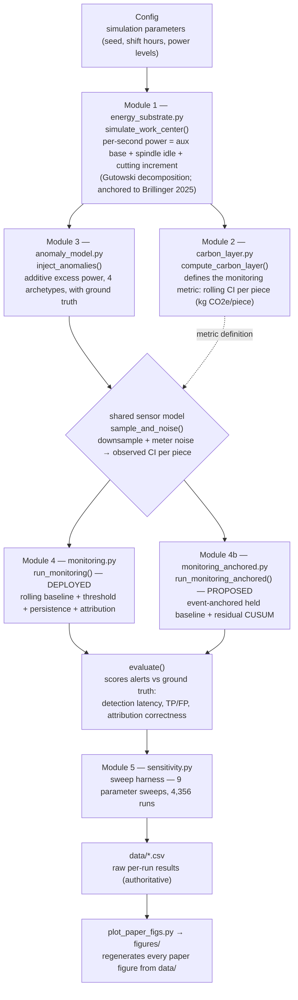

# Detection limits of MES-embedded carbon-intensity monitoring

[](https://github.com/lesiayanytska78/ci-monitoring-simulation/actions/workflows/tests.yml)
[](https://pypi.org/project/ci-monitoring-simulation/)
[](LICENSE)
[](https://doi.org/10.5281/zenodo.21118495)
[](https://colab.research.google.com/github/lesiayanytska78/ci-monitoring-simulation/blob/main/notebooks/quickstart.ipynb)
[](https://lesiayanytska78.github.io/ci-monitoring-simulation/architecture.html)

Simulation code, raw sweep data, and figure-generation scripts for the paper:

> **Yanytska, L. (2026).** *Detection limits of MES-embedded carbon-intensity monitoring for energy anomalies: a calibrated simulation study in machining-style processes.* Manuscript in preparation.

This repository reproduces every figure in the paper from the 4,356 raw simulation runs released in `data/`.

> **Companion method (Paper 2):** the [`paper2_anchored_detector/`](paper2_anchored_detector/) folder contains the proposed *event-anchored + residual-CUSUM* detector that closes the adaptive-baseline inertia blind spot characterised in this study, together with its full evaluation — the operating-point calibration, the detector ablation, generalisation across severity, and validation on **real** Brillinger spindle-power traces. See that folder's README.

---

## Try it first (no install)

The fastest way to see the headline result is the **[Colab quickstart notebook](https://colab.research.google.com/github/lesiayanytska78/ci-monitoring-simulation/blob/main/notebooks/quickstart.ipynb)** — it runs entirely in your browser with nothing to install. Open it, choose *Runtime ▸ Run all*, and you'll reproduce the result in about a minute.

## Requirements (for local use)

- **Python 3.9 or newer.** Check yours with `python3 --version`. If you don't have Python, install it from [python.org](https://www.python.org/downloads/) (macOS/Windows) or your package manager. `pip` ships with Python 3.4+; if `pip` is somehow missing, run `python3 -m ensurepip --upgrade`.
- Dependencies (`numpy`, `pandas`, `matplotlib`) install automatically with the package below — you don't need to install them by hand.

## Install

The simulation framework (Modules 1–5) and the proposed detector are available as an installable package, `cimonitoring`:

```bash
pip install ci-monitoring-simulation
# or, the latest development version straight from GitHub:
pip install git+https://github.com/lesiayanytska78/ci-monitoring-simulation.git
# or, from a local clone:
pip install .
```

> **Tip:** to keep this isolated from your other Python projects, create a virtual environment first:
> ```bash
> python3 -m venv venv && source venv/bin/activate   # Windows: venv\Scripts\activate
> pip install ci-monitoring-simulation
> ```

```python
import cimonitoring as ci
sub = ci.simulate_work_center(ci.Config(seed=1))
sub = ci.inject_anomalies(sub, ci.AnomalyConfig([
    ci.AnomalySpec(onset_hour=10, duration_minutes=240, magnitude_kw=2.0,
                   onset_profile="ramp", onset_ramp_seconds=3600,
                   affects="spindle", label="slow ramp")]))
obs = ci.run_monitoring_anchored(
    sub, ci.AnchoredMonitorConfig(detector="anchored_cusum"),
    ci.CarbonConfig().static_emission_factor_kg_per_kwh)
```

The figure-reproduction below reads the released CSVs and does not require installation.

---

## Quick reproduction

```bash
# 1. Clone and enter the repository
git clone https://github.com/lesiayanytska78/ci-monitoring-simulation.git
cd ci-monitoring-simulation

# 2. Install dependencies (Python 3.9 or newer)
pip install -r requirements.txt

# 3. Regenerate all seven figures from the released CSVs
python plot_paper_figs.py
```

Expected output: seven PNGs written to `figures/`. Wall time on a single CPU core: under one minute. `plot_paper_figs.py` reads only the CSVs in `data/` and writes only to `figures/` — it does not require the simulation modules.

A `Makefile` provides shortcuts: `make install`, `make figures`, `make test`.

## Tests

A `pytest` suite in `tests/` exercises the full pipeline end to end — the energy substrate, carbon layer, anomaly model, the deployed detector, and the proposed event-anchored + CUSUM detector — and includes a regression test for the paper's headline result (the fixed-reference detector fires on a slow ramp the deployed detector misses) and an integrity check that the released CSVs load and the shared simulation modules do not drift between `simulation/` and `paper2_anchored_detector/`. Run with:

```bash
pip install -r requirements.txt pytest
pytest -q
```

Continuous integration runs the suite on Python 3.9, 3.11, and 3.12 on every push (see the badge above).

### Re-running the simulations from scratch (optional)

The five simulation modules live in `simulation/`. The sweep functions that produced `data/` are in `simulation/sensitivity.py`; the default sweep set (Sweeps 1–6) runs from its `__main__` block, and the ramp-time, boundary, and ramp-transition sweeps (Sweeps 7–9) are provided as functions in the same module. Output paths are set at the bottom of the script — adjust them to your environment before running. The released CSVs in `data/` are the authoritative results behind every reported number.

---

## Repository layout

```
.
├── README.md                                  this file
├── LICENSE                                    MIT (code)
├── requirements.txt                           numpy, pandas, matplotlib
├── CITATION.cff                               machine-readable citation
│
├── plot_paper_figs.py                         generates Figures 1–7 from data/
│
├── simulation/                                Module 1–5 simulation harness
│   ├── energy_substrate.py                    Module 1 — energy substrate (Gutowski decomposition)
│   ├── carbon_layer.py                        Module 2 — carbon layer (rolling CI per piece)
│   ├── anomaly_model.py                       Module 3 — four-archetype anomaly model
│   ├── monitoring.py                          Module 4 — MES/SCADA sensor + rule-based detector
│   └── sensitivity.py                         Module 5 — sensitivity-sweep harness
│
├── data/                                      raw per-run results (4,356 rows total)
│   ├── sweep1_latency.csv                     severity × duration (300 runs)
│   ├── sweep2_sampling.csv                    severity × meter cadence (240)
│   ├── sweep3_roc.csv                         relative-threshold tightness (240)
│   ├── sweep4_archetypes.csv                  severity × four archetypes (240)
│   ├── sweep5_threshold_types.csv             absolute / relative / statistical (496)
│   ├── sweep6_attribution.csv                 severity × affected channel (140)
│   ├── sweep7_ramp_time.csv                   severity × ramp time × seed (650)
│   ├── sweep8_boundary.csv                    50-seed boundary, 1.0–2.0 kW (250)
│   └── sweep9_ramp_transition_200seed.csv     200-seed fine transition (1,800)
│
├── figures/                                   the seven paper figures (PNG)
│
└── docs/
    └── parameter_provenance.md                full [ANCHORED]/[LITERATURE]/[ASSUMPTION] table
```

---

## Architecture

The system is a **layered simulation pipeline**: each stage produces a `pandas.DataFrame` that the next consumes, so any stage can be inspected, swapped, or re-run in isolation. The same observed signal is fed to two interchangeable detectors — the deployed adaptive-baseline detector and the proposed event-anchored detector — which makes the head-to-head comparison a controlled experiment rather than two separate runs.



The key design property is the **shared sensor stage**: `sample_and_noise()` lives in Module 4 and is reused unchanged by Module 4b, so both detectors see the *identical* observed signal and any difference in detection performance is attributable to the detection logic alone.

| Layer | File | Responsibility | Key public API |
|---|---|---|---|
| Module 1 — Energy substrate | `energy_substrate.py` | Per-second power for one work center: auxiliary base + spindle no-load + cutting increment (engaged only while cutting). Structure follows Gutowski et al. (2006); the no-load spindle range is anchored to the Brillinger et al. (2025) CNC dataset. | `Config`, `simulate_work_center()` |
| Module 2 — Carbon layer | `carbon_layer.py` | Layer emissions and carbon intensity. Defines the central monitoring signal — **rolling CI per piece** — which rises when energy climbs but output does not. | `CarbonConfig`, `compute_carbon_layer()` |
| Module 3 — Anomaly model | `anomaly_model.py` | Inject parametrized faults as additive excess power with no extra output, recording exact onset/magnitude/duration as **ground truth**. Four archetypes. | `AnomalyConfig`, `AnomalySpec`, `inject_anomalies()` |
| Module 4 — Monitoring (deployed) | `monitoring.py` | Model the MES/SCADA view (downsampled, noisy), then the deployed detector: rolling baseline + threshold + tiered persistence + attribution. Includes the evaluation scorer. | `MonitorConfig`, `run_monitoring()`, `sample_and_noise()`, `evaluate()` |
| Module 4b — Monitoring (proposed) | `monitoring_anchored.py` | The proposed detector closing the inertia blind spot: **event-anchored held baseline** + **residual CUSUM** on the dimensionless residual. Reuses Module 4's sensor model for a controlled comparison. | `AnchoredMonitorConfig`, `run_monitoring_anchored()` |
| Module 5 — Sensitivity harness | `sensitivity.py` | Run the substrate → anomaly → monitor → evaluate pipeline across parameter sweeps; write raw per-run results to CSV. No tuning to targets. | sweep functions |
| Reproduction | `plot_paper_figs.py` | Regenerate every figure purely from the released CSVs (no simulation modules required). | — |

▶ **[Open the interactive diagram](https://lesiayanytska78.github.io/ci-monitoring-simulation/architecture.html)** — clickable components, flow overlay, and themes (source: `architecture.html`). A fuller write-up with design rationale and extension points is in `ARCHITECTURE.md`.

---

## How paper claims map to data

Every figure and headline number is reproducible from one CSV in `data/`.

| Paper claim | Section | CSV |
|---|---|---|
| Detection rate vs severity, three durations | §4.1, Fig. 1 | `sweep1_latency.csv` + `sweep8_boundary.csv` |
| 80%-detection threshold ≈ 47% of baseline (1.6 kW) | §4.1 | `sweep8_boundary.csv` |
| Detection rate at four meter cadences | §4.2, Fig. 2 | `sweep2_sampling.csv` |
| Threshold-tightness ROC | §4.3, Fig. 3 | `sweep3_roc.csv` |
| Four-archetype comparison | §4.4, Fig. 4 | `sweep4_archetypes.csv` |
| Threshold-family ROC (abs / rel / stat) | §4.5, Fig. 5 | `sweep5_threshold_types.csv` |
| Attribution accuracy by channel | §4.6, Fig. 6 | `sweep6_attribution.csv` |
| Inertia-trade-off sigmoid (200 seeds) | §4.7, Fig. 7 | `sweep9_ramp_transition_200seed.csv` |
| Coarse multi-severity inertia behaviour | §4.7 | `sweep7_ramp_time.csv` |

---

## Parameter provenance

Every numeric parameter in the simulation carries one of three provenance tags, documented in `docs/parameter_provenance.md`:

- **`[ANCHORED]`** — fitted to a real measurement in the Brillinger et al. (2025) open CNC dataset.
- **`[LITERATURE]`** — taken from published sources cited in the paper.
- **`[ASSUMPTION]`** — engineering estimate, exercised in the sensitivity analysis.

The two `[ANCHORED]` values — the 0.80–0.99 kW no-load spindle range and the regenerative-braking behaviour — were extracted by the author from the raw Brillinger dataset; the extraction procedure is described in the paper's Methods (§3.2). The Brillinger dataset itself is **not** redistributed here: it is available from Mendeley Data (DOI 10.17632/gtvvwmz7r7.2, CC BY-NC) and must be downloaded separately to re-derive the anchored values.

---

## Citation

If you use this code or data, please cite the paper and the archived repository:

```bibtex
@article{yanytska2026detection,
  title   = {Detection limits of MES-embedded carbon-intensity monitoring for energy anomalies:
             a calibrated simulation study in machining-style processes},
  author  = {Yanytska, Lesia},
  year    = {2026},
  note    = {Manuscript in preparation}
}

@software{yanytska2026code,
  author    = {Yanytska, Lesia},
  title     = {Detection limits of MES-embedded carbon-intensity monitoring: simulation code and data},
  year      = {2026},
  publisher = {Zenodo},
  version   = {v2.2.5},
  doi       = {10.5281/zenodo.21118495},
  url       = {https://doi.org/10.5281/zenodo.21118495}
}
```

This release is permanently archived on Zenodo: **DOI [10.5281/zenodo.21118495](https://doi.org/10.5281/zenodo.21118495)**. A machine-readable `CITATION.cff` is included at the repository root.

---

## Licence

- **Code** (`simulation/`, `plot_paper_figs.py`): MIT — see `LICENSE`.
- **Data** (`data/`): CC BY 4.0 — free to reuse with attribution.
- The upstream Brillinger et al. (2025) dataset, from which the anchored spindle values were derived, is **CC BY-NC**; commercial reuse of those specific anchored values must comply with the upstream licence.

---

## Contact

Lesia Yanytska — lesiayanytska@gmail.com

Issues and pull requests are welcome.
