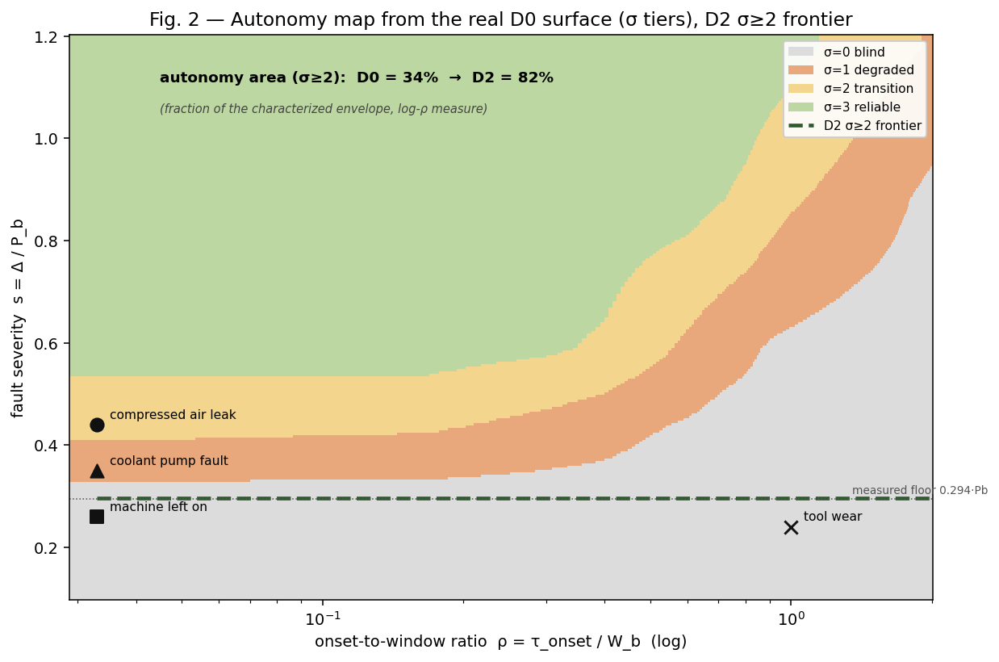
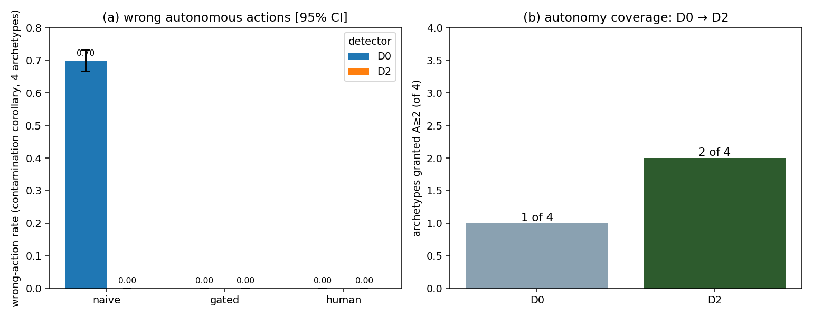
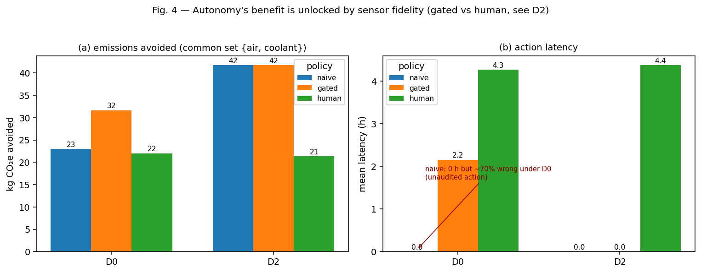

# Measurement-bounded autonomy: characterized detection limits as the governance boundary for carbon-intelligent energy agents in manufacturing execution systems

Lesia Yanytska

Luxoft USA Inc., Chicago, IL, USA — lesiayanytska@gmail.com — ORCID 0009-0007-1728-8599

*Manuscript v1.2 (submission). Target: Journal of Manufacturing Systems.*

---

## Abstract

Autonomous decarbonization agents are being proposed for the manufacturing execution system (MES) layer, yet the boundary between what such an agent may do alone and what it must escalate to a human is typically asserted rather than derived. We argue that trustworthy autonomous decarbonization is bottlenecked by measurement fidelity, and that the characterized detection limits of the sensing layer should define the autonomy/escalation boundary for a carbon-intelligent energy agent. We formalize this as an epistemic contract: a characterized detectability surface, read at its 95% bootstrap confidence lower bound, is mapped to sensing tiers via three cut-points — each inherited, derived, or ablated rather than free — and composed with an ISA-95-anchored action-reversibility tier to yield the autonomy grant A = min(σ, α). Two gating modes cover standing grants from a fault registry (ex-ante) and alarm response with attribution-confidence capping (ex-post). In a deterministic multi-agent demonstration driven by the real archived detection surface of peer-reviewed prior work, a naive always-autonomous policy takes the wrong action at least 70% of the time under the deployed detector, while the gated policy is wrong 0% of the time; a detector upgrade expands the autonomy-safe region from 34% to 82% of the characterized envelope; and where sensing is reliable, gated autonomy captures ≈1.9× the avoided emissions of a human-approves-everything policy at zero response latency. The framework converts "how much autonomy is safe?" into a measurable, auditable property of the instrument.

**Keywords:** manufacturing execution systems; carbon intensity; autonomous agents; levels of automation; detection limits; governance; ISA-95

---

## 1. Introduction

### 1.1 Motivation

Real-time carbon-intensity (CI) monitoring — emissions per unit produced, resolved at the work-centre level — is increasingly embedded in the MES to surface energy anomalies before they accumulate into significant emissions [12]. The regulatory environment now gives that signal legal weight: the EU Carbon Border Adjustment Mechanism entered its definitive regime on 1 January 2026, pricing verified embedded emissions via quarterly certificate reference prices [22]; the Corporate Sustainability Reporting Directive [23] and product-level standards (ISO 14067 [24]; ISO 14955-1 [25]) reinforce the same demand for verified, installation-level emissions data. As monitoring matures, vendors and researchers propose closing the loop: allowing a *carbon-intelligent energy agent* to act on anomalies autonomously — shedding an idling load, deferring a job to a cleaner grid window, flagging a worn tool.

The obvious governance question is: **what should such an agent be allowed to do without a human in the loop?** Prevailing agent frameworks answer with capability tiers, policy expressiveness, or optimization objectives [1, 2, 6]. We argue this is the wrong primitive. An agent cannot safely act on what its sensors cannot reliably resolve. If the monitoring layer systematically misses a slow-onset fault, then granting the agent authority to act on that fault class is not a policy choice — it is an unbacked promise. This question has not been asked for manufacturing agents, and no existing framework derives the autonomy boundary from characterized detection limits. The vehicle-control-authority patent literature [15] and the sensor-based-control-limits literature [14] are acknowledged cross-domain precedent for tying authority to sensing, but neither addresses the MES decarbonization setting nor grounds the boundary in an empirically characterized detectability surface.

### 1.2 Contribution and scope

Our contribution is a **governance architecture**: ISA-95-anchored authority lines [18] and standards-mapped human oversight (ISO/IEC 42001 [9]; ISO/IEC TR 5469 [10]; the EU AI Act [11]), in which the autonomy boundary is *derived* from the characterized detection limits of the sensing layer. The accompanying simulation is integral supporting evidence for the architecture, not the contribution in itself. This positioning is deliberate with respect to the journal's scope: the artifact offered here is the governance framework — the epistemic contract, the ISA-95 authority composition, and the standards-mapped oversight regime — and the simulation demonstrates, on real archived data, that the framework does what it claims.

Concretely, we (i) formalize an epistemic contract linking a characterized detectability surface to autonomy grants; (ii) define two gating modes — ex-ante standing grants and ex-post alarm response with attribution-confidence capping; and (iii) demonstrate on a real archived detection surface that gating eliminates the wrong-action rate an ungoverned agent would incur, while still outperforming a human-only baseline on captured emissions and latency. The demonstration is a mechanism demonstrator, not a key-performance-indicator validator: it shows the autonomy boundary behaves as designed, not that any particular plant-level efficiency is achievable.

## 2. Related work

Agentic AI in manufacturing has advanced rapidly. Farahani, Khan and Wuest present a hybrid agentic-AI and multi-agent architecture for prescriptive maintenance, in which large-language-model agents provide strategic orchestration over rule-based and small-model tactical layers, with human review positioned as a supervisory layer rather than as a requirement imposed by the sensing substrate [1]. Ren et al. survey the plethora of AI-agent and agentic-AI concepts for future manufacturing, tracing the transition from rule-based automation to intelligent autonomy [2]. Foundation-model agents have been proposed as "first-class industrial entities," where the authors are explicit that the delegation boundary — how much autonomy to grant — is itself unsolved [3]. A practitioner articulation of agentic governance for MES-embedded carbon intelligence appeared in [19].

Multi-agent coordination in manufacturing traces to the Contract Net Protocol [4] and the agent-based distributed-control tradition surveyed by Leitão [28]. Carbon-aware scheduling reduces emissions by shifting load to low-carbon-intensity periods: Haddad et al. report on the order of 7% CO₂e reduction in aerospace machining [27], and Mencaroni et al. extend carbon-aware flow-shop scheduling to time-varying grid CI with on-site renewables [5]. This literature optimizes *against* the carbon signal but does not interrogate the signal's own detection fidelity; that unasked question is our entry point.

Levels-of-automation research supplies the vocabulary of graduated authority, from Sheridan and Verplank's classical taxonomy [8] to Feng, McDonald and Zhang's five agent-autonomy levels (operator, collaborator, consultant, approver, observer) [6]; the automotive domain encodes driving-automation levels in SAE J3016 [7], and the patent literature adjusts vehicle control authority dynamically from characterized operating conditions [15]. Control theory supplies fundamental limits: Pacelli and Theodorou derive lower bounds on achievable feedback-control cost from the information a sensor can provide [14]. Uncertainty-gated autonomy has been studied in robotics, where the value of confidence gating depends on a competence regime [13], and governance frameworks for military AI agents propose measurable control-quality metrics with graduated responses [16]. Across all of these, autonomy levels are asserted by design judgment or gated on runtime self-confidence; none derives the *manufacturing* autonomy boundary from an empirically characterized detection surface. That is the gap this paper closes.

## 3. The sensing substrate and its characterized limits

The contract reads a detectability characterization that has been independently established and peer-reviewed [12]; because that characterization is published, the surface this contract reads is an externally validated input, not a modelling artifact of the present paper. The characterization is a calibrated, fully reproducible simulation of MES-embedded CI monitoring in machining-style processes — an architecture whose practitioner articulation appeared in [17] — anchored to the open Brillinger et al. CNC dataset [20, 21], with every parameter carrying a provenance tag. Across a sensitivity campaign of 4,356 scenarios it establishes two results.

First, a **detection floor**: the published characterization reports the 80% detection crossing at approximately 47% of baseline power, lying between the bracketing measured points (76% detection at 44% of baseline; 94% at 52%) [12]. Second, an **adaptive-baseline inertia trade-off**: faults that develop slowly relative to the monitoring window are absorbed into the baseline and systematically missed, characterized as a function of the dimensionless onset-to-window ratio ρ = τ_onset/W_b, with an 80%-detection knee at ρ ≈ 0.43, a 50% midpoint at ρ ≈ 0.69, and collapse to ≈24% at ρ = 1 [12].

A companion study [31] introduces an event-anchored, fixed-reference detector that holds its baseline at defined plant events so slow drift accumulates against a reference that does not chase it; on the archived multi-severity surface, this upgraded detector achieves ≈1.0 detection across the whole onset range down to its lowest *measured* severity of 1.0 kW = 0.294·P_b. Throughout, the deployed rolling-baseline detector is denoted **D0** and the event-anchored detector **D2**; severity is s = Δ/P_b (P_b = 3.4 kW in the reference configuration).

## 4. The epistemic contract

### 4.1 Detectability surface and cut-points

We treat the characterized detectability surface P_det^d(s, ρ) for detector configuration d as the primitive. To be conservative, the surface is read at its **95% bootstrap confidence lower bound**, never at its point estimate. This has a consequence worth highlighting because it is the framework's philosophy in miniature: at the ρ ≈ 0.43 knee the point estimate is ≈0.80 but the lower bound is ≈0.71, so the situation gates to the *transition* tier, not *reliable* — measurement uncertainty tightens the autonomy boundary inward, and additional characterization seeds would legitimately widen it. Outside the measured envelope the surface extends only in the two directions in which the measured monotone behavior justifies a flat clamp (higher severity; faster onset), held at the nearest measured cell and flagged as extended; sub-floor severity and slower-than-characterized onset remain blind by construction, so every grant traces to a measurement plus two stated monotonicity axioms.

The conservative read is mapped to a discrete sensing tier σ via three cut-points:

- **c₃ = 0.80** (σ = 3, reliable) — inherited from the reliable-detection convention embedded in the published characterization's 80% crossing, defended there at ≤0.05 false alarms per production-hour [12];

- **c₂ = 0.50** (σ = 2, transition) — the preponderance standard: act-with-veto is permitted only where detecting the premise fault is more likely than not; the boundary happens to coincide with the measured sigmoid midpoint (ρ ≈ 0.69);

- **c₁ = 1 − exp(−r_FA·T_h) ≈ 0.181** (σ = 1/σ = 0 boundary) — a false-alarm-equivalence floor with nuisance-alarm rate r_FA = 0.05/h and human-response horizon T_h = 4 h. Below this detectability, the detector's true-positive yield over the response horizon is comparable to its characterized false-alarm yield: an alarm is roughly as likely noise as signal, which is the operational meaning of blind.

The construction uses **no free constants: every value is inherited, derived, or ablated.** The single genuinely chosen constant is the horizon T_h = 4 h; its influence is established by the sensitivity inversion in §5.5.

### 4.2 Authority composition and gating modes

The sensing tier composes with an **ISA-95-anchored action-reversibility tier α**, drawn from the enterprise-control hierarchy of IEC 62264-1 [18], via **A = min(σ, α)**: A = 3 autonomous act and log; A = 2 act and notify (veto window); A = 1 propose and wait; A = 0 mandatory escalation. Native Level-3 (MOM) actions — deferring a job (α = 3), shifting load across CI windows (α = 2), dispatching maintenance or quarantining WIP (α = 1) — are exposed by real MES products; the only Level-2 actions in the space (throttle/setpoint) a pure MES can only *request* of the control layer, so they are **capped at act-and-notify regardless of σ**, and anything touching interlocks is α = 0, never autonomous. Authority is thus the weaker of what the instrument can prove it detects and what the plant's existing authority hierarchy permits.

Two gating modes operationalize the contract. **Ex-ante** gating issues standing grants by evaluating the contract against a fault registry offline: each registered archetype receives an autonomy tier per detector before deployment. This mode addresses the subtlest failure of an ungoverned agent — confident *inaction* on a signal it cannot trust. In any standing-blind region the CI signal is untrustworthy not merely as an alarm source but as an *optimization input*: an undetected fault silently biases every per-piece CI number the energy agent optimizes, so measurement blindness contaminates action even when no action is a response to a fault. Where a class is standing-blind, the contract therefore mandates a scheduled human/inspection pathway rather than silent trust. **Ex-post** gating handles live alarms, capping the grant by the attribution confidence of the fired alarm so that a low-confidence attribution — including a false alarm, which is by definition a low-confidence positive — cannot inherit a high-confidence archetype's standing grant.

When the sensing tier is blind, the contract distinguishes two kinds because the remedy differs: a *characterized-blind* situation lies inside the measured envelope with detectability below c₁ (a structural limit of the instrument), whereas a *measurement-demand* situation lies below the detector's measured floor — genuinely uncharacterized — and there the contract refuses the unmeasured grant and issues a pre-deployment measurement order.

## 5. Simulation demonstration

### 5.1 Setup and the dual treatment of sub-floor classes

We evaluate three policies — **naive** (always autonomous), **gated** (autonomy bounded by the contract), and **human-only** — against the two detector configurations D0 and D2, over four fault archetypes drawn from the published characterization's registry (compressed-air leak, 0.44·P_b, fast onset; coolant-pump fault, 0.35·P_b, step; machine-left-on, 0.26·P_b, step; tool wear, 0.24·P_b, slow onset at ρ ≈ 1) [12]. The evaluation reuses the real archived detectability surface (200 seeds per characterized cell); no new detection model is fit here. The grid carbon-intensity trace derives from the UK NESO Carbon Intensity API [26], pinned by a snapshot hash for reproducibility.

Two distinct severity thresholds govern what follows and must not be conflated. The **80% detection crossing** (≈0.47·P_b under D0) separates *reliable* from *sub-reliable* detection; the **measured envelope floor** (0.294·P_b — the lowest severity either characterization campaign measured) separates *characterized* from *uncharacterized*. Coolant (0.35·P_b) sits above the measured floor but below the 80% crossing, so under D0 it gates to *degraded* (propose-and-wait). Machine-left-on (0.26) and tool wear (0.24) sit **below the measured floor**, so under both detectors they gate to *blind* as measurement-demands. These sub-floor classes receive a **dual treatment**, stated explicitly so §5.1 and §5.2 cannot be read as contradictory: for **gating**, they are blind — the contract refuses autonomous authority and raises a measurement order; for **scoring the naive policy's wrong-action rate**, their miss rates are conservatively upper-bounded using the floor measurement (detection ≤ 0.08 for machine-left-on, ≤ 0.02 for tool wear). One measurement, two uses — a withheld grant and a bound on how often the ungoverned agent acts on a corrupted signal.

### 5.2 Wrong action is concentrated where the sensor is weak

A policy commits a wrong action in a fault scenario whenever it does not escalate and the fault is undetected — it acts, or keeps optimizing, on a corrupted signal. Scored over all four archetypes (Figure 3a; Table 1), the naive policy is wrong **at least 70% of the time under D0** (95% CI [0.67, 0.73]); the "at least" is exact, because the sub-floor miss rates are bounds, making 0.70 a conservative lower bound on naive's true rate. The gated and human-only policies hold it at **0%**. Under the strong D2 detector naive is also safe on the classes D2 resolves (0%, 2 of 4 scored): naive autonomy is dangerous exactly in proportion to sensor weakness, and the governance layer's value is concentrated precisely where the sensor is unreliable — costing nothing where the sensor is good.

**Table 1. Six-cell results matrix.** Wrong-action rate is scored over all archetypes resolvable per detector (contamination-corollary definition); emissions and latency are reported over the common set {air-leak, coolant} — the two classes above the measured floor under both detectors — so all six cells sum identical scenarios.

| Detector | Policy | Wrong-action rate [95% CI] (scored) | Emissions avoided (kg CO₂e) | Mean latency (h) |
|---|---|---|---|---|
| D0 | naive | ≥0.70 [0.67, 0.73] (4/4) | 23 | 0 |
| D0 | gated | 0.00 (4/4) | 32 | 2.2 |
| D0 | human | 0.00 (4/4) | 22 | 4.3 |
| D2 | naive | 0.00 (2/4) | 42 | 0 |
| D2 | gated | 0.00 (2/4) | 42 | 0 |
| D2 | human | 0.00 (2/4) | 21 | 4.4 |

### 5.3 Coverage under detector upgrade

Because the grant is a function of the detector, improving the instrument — not loosening the gate — is how the autonomous region grows. Under the upgrade D0 → D2, the σ ≥ 2 area of the fault plane expands from **34% to 82% of the characterized envelope** (log-ρ measure; Figure 2), and the archetypes admissible for standing grants rise from **1 to 2 of 4** (Figure 3b). The gate itself is never loosened; the autonomy-safe region expands as a measured consequence of a better instrument. This is the framework's normative punchline: autonomy is earned by characterizing and improving measurement, not by relaxing oversight.

### 5.4 Escalation decomposition and its asymmetry

The gated policy's escalations decompose into two quantities, and the decomposition is deliberately asymmetric across detectors. Under D0, all three sub-reliable classes are counted **contract-correct**: D0 is the deployed detector, and its sub-floor blindness is a structural limit of the instrument class — an established result of the peer-reviewed characterization [12] — so withholding is simply correct. Under D2, the two remaining sub-floor classes are counted **price-of-rigor**: D2's sub-floor blindness is a characterization gap (the companion severity sweep bottomed out at 1.0 kW), so the surface is merely unmeasured below that point, not proven blind. That gap is closable by an "earn-the-margin" measurement — extending the sweep — which is why it is scored as a price of rigor rather than a structural miss. Escalation recall is 1.00 by construction.

The cost of ungated autonomy appears on clean days. A false alarm carries low attribution confidence, so the ex-post cap routes it to escalation: the gated policy takes **zero** false autonomous actions on fault-free days. The naive policy acts on every false alarm; at the characterization's defended budget of 0.05 false alarms per production-hour this amounts to **≈16.8 false autonomous actions per 14 clean days**, versus 0 for gated.

### 5.5 Sensitivity inversion

Because c₂ and c₁ are policy-derived, we re-gate (no re-simulation) at c₂ ∈ {0.4, 0.5, 0.6} and c₁ ∈ {0.10, 0.18, 0.30}. All grants are stable at the derived operating point (c₂ = 0.50, c₁ = 0.181), which sits in the interior of the stable region. The one flip within the swept range is conservative-direction and physically legible: the coolant grant demotes from degraded to blind once **c₁ ≥ ≈0.28**, which — inverting 1 − e^(−0.05·T) = 0.28 — corresponds to an assumed human-response horizon exceeding **≈6.7 h**. The framework thus tells an operator exactly which deployment assumption the coolant grant depends on: a robustness statement with physical meaning rather than an assertion of insensitivity across an arbitrary range.

### 5.6 Economics

Under D2 the gated policy captures **42 kg CO₂e at zero latency** versus **21 kg at 4.4 h** for the human-only policy — roughly a **1.9×** advantage at identical safety — and gated capture rises from 32 to 42 kg with the detector upgrade, while human-only is flat (≈22 kg, detector-independent). The economic benefit of autonomy is therefore not free-standing; it is unlocked by sensor fidelity. Valued at the EU CBAM certificate reference price — €75.36/tCO₂e for Q1 2026 (the first price under the definitive regime, published 7 April 2026) and €75.28/tCO₂e for Q2 2026 [22] — the per-event carbon value is modest; the deployment-gating economics lie instead in the elimination of wrong autonomous actions, whose downstream costs (unnecessary interventions, spurious maintenance, eroded operator trust) are what actually decide adoption.

## 6. Discussion

The contract makes measurement fidelity, not policy expressiveness, the governing variable for autonomous decarbonization, and it is implementable within the governance instruments now taking shape: it is a concrete instance of ISO/IEC TR 5469's demand to bound AI authority by characterized capability [10], auditable under an ISO/IEC 42001 management system [9], and a mechanism for the human-oversight obligation of Article 14 of the EU AI Act [11]. For regulators, it makes "verified emissions" operational at the level of autonomous action: an agent may act on the CI signal only where that signal's detection performance is characterized as trustworthy.

Limitations follow from the construction. The contract inherits the epistemic boundaries of the characterization it reads: its grants are only as good as the campaigns behind them, and the demonstration is a single-work-centre mechanism study with simulated faults, not a plant validation. The sub-floor detection rates are bounds, not measurements — which is why naive's wrong-action rate is reported as a lower bound — and the economic figures are in-simulation carbon-timing proxies, not plant KPIs. The event-anchored detector's predicted advantage below 0.294·P_b is, at present, a prediction the framework refuses to grant on — correctly.

A concrete research agenda follows. *Earn the margin*: additional seeds at a class's characterized corner narrow its confidence interval and lift its lower bound away from the cut-points — pure re-gating, no re-simulation — converting price-of-rigor escalations into grants. *A second invariant*: fusing detectability with model-based energy residuals so autonomy is gated by agreement between two independent estimators. *Verification of non-deterministic proposers*: an LLM layer may propose into the deterministic verifier, but certifying that a proposer's distribution respects the boundary is open. *Secure exposure of the sensing layer to agents*: as MES agents adopt the Model Context Protocol for tool invocation, the trust-boundary risks catalogued in the NSA's security-design guidance [29] and the OWASP MCP Top 10 (beta) [30] intersect directly with the attribution-confidence capping of the ex-post gating mode. Field validation on instrumented machine tools remains the natural next step [12].

## 7. Conclusion

Characterized detection limits should define the autonomy/escalation boundary for carbon-intelligent energy agents in the MES. Read at its conservative lower confidence bound and composed with an ISA-95 action-reversibility tier, the characterized detectability surface yields an autonomy grant that is derived, reproducible, and auditable. On a real archived surface, gating eliminates the ≥70% wrong-action rate an ungoverned agent would incur under the deployed detector while beating human-only response on both captured emissions (42 vs 21 kg CO₂e) and latency (0 vs 4.4 h) where sensing is reliable, and a detector upgrade expands the autonomy-safe region from 34% to 82% of the characterized envelope in a quantified way. The principle is simple to state and, we hope, difficult to refute: you cannot decarbonize a factory you cannot see, and you cannot let an agent act where it cannot see either.

---

### Figure captions

**Fig. 1.** Measurement-bounded autonomy in the five-layer agentic MES architecture: the sensing layer's offline characterization feeds the epistemic contract in the governance layer (surface → cut-points → σ, composed with the ISA-95 reversibility tier α to give A = min(σ, α)), which constrains the agentic layer and escalates to the human layer where warranted.

**Fig. 2.** Autonomy map evaluated on the real archived D0 detectability surface (conservative lower-bound gate): sensing tiers over the (ρ, s) plane with the four registry archetypes marked and the D2 σ ≥ 2 frontier (dashed) at the measured floor of 0.294·P_b. The σ ≥ 2 area expands from 34% to 82% of the characterized envelope (log-ρ measure) under the D0 → D2 upgrade.

**Fig. 3.** Policy comparison. **(a)** Wrong-action rate by detector and policy (contamination-corollary definition, 95% CI): naive is wrong ≥0.70 [0.67, 0.73] under D0 and 0 under gating. **(b)** Archetypes admissible for standing grants: 1 → 2 of 4 under the D0 → D2 upgrade. Panel (b) is a property of the contract evaluated on the fault registry and involves no simulation.

**Fig. 4.** The gated-versus-human differentiator. **(a)** Emissions avoided over the common set {air-leak, coolant}: under D2, gated captures ≈1.9× human-only at zero latency; gated rises 32 → 42 kg with the detector upgrade while human-only is flat. **(b)** Action latency; naive's zero latency is the latency of unaudited action (≥70% wrong under D0).

---

### Data and code availability

The proof-of-concept — the epistemic contract, the surface builder that regenerates the detectability surfaces from the archived characterization campaigns, the multi-agent simulation, and the figure/metric pipeline — is released under the MIT licence (code) and CC BY 4.0 (first-party data), REUSE-3.3 compliant, in the `ci-monitoring-simulation` repository (github.com/lesiayanytska78/ci-monitoring-simulation). The v2.2.5 snapshot cited by the published characterization [12] is archived at DOI 10.5281/zenodo.21118495; the current release is v2.2.6 (DOI 10.5281/zenodo.21268863); the artifacts specific to the present work will be archived as a further new version of the same Zenodo record, with the version DOI minted at release. Grid carbon-intensity data derive from the UK NESO Carbon Intensity API (CC BY 4.0) [26]. The machining calibration substrate is the open Brillinger et al. CNC dataset, Mendeley Data V2, DOI 10.17632/gtvvwmz7r7.2 [20], licensed CC BY 4.0 as shown on the current Mendeley Data page (accessed 13 July 2026).¹

¹ The published characterization [12] recorded this dataset's licence as CC BY-NC, reflecting the designation available at that time; the current Mendeley Data page displays CC BY 4.0. We cite the licence as currently shown and note the prior designation explicitly to avoid a silent contradiction between the two papers.

### Competing interests

The author is employed by Luxoft USA Inc. as Chief Product Manager of its MES Suite. The MES-embedded carbon-intensity monitoring and agentic-governance subject matter studied here falls within the author's professional domain. The research — its design, execution, analysis, and conclusions — was conducted independently; Luxoft USA Inc. had no role in the study and exercised no control over its content. The author declares this employment as a potential competing interest.

### Funding

The author received no funding for this work.

---

### References

[1] M.A. Farahani, M.I. Khan, T. Wuest, Hybrid agentic AI and multi-agent systems in smart manufacturing, J. Manuf. Syst. 86 (2026) 612–623. https://doi.org/10.1016/j.jmsy.2026.04.002

[2] Y. Ren, Y. Liu, T. Ji, X. Xu, AI agents and agentic AI—navigating a plethora of concepts for future manufacturing, J. Manuf. Syst. (2025). https://doi.org/10.1016/j.jmsy.2025.08.017

[3] Agent manufacturing: foundation-model agents as first-class industrial entities, arXiv:2605.24823 (2026), preprint.

[4] R.G. Smith, The Contract Net Protocol: high-level communication and control in a distributed problem solver, IEEE Trans. Comput. C-29 (12) (1980) 1104–1113. https://doi.org/10.1109/TC.1980.1675516

[5] A. Mencaroni, P. Leyman, B. Raa, S. De Vuyst, D. Claeys, Towards net-zero manufacturing: carbon-aware scheduling for GHG emissions reduction, J. Clean. Prod. 529 (2025) 146787. https://doi.org/10.1016/j.jclepro.2025.146787

[6] K.J.K. Feng, D.W. McDonald, A.X. Zhang, Levels of autonomy for AI agents, arXiv:2506.12469 (2025), preprint; Knight First Amendment Institute working paper, Columbia University, 2025.

[7] SAE International, Taxonomy and Definitions for Terms Related to Driving Automation Systems for On-Road Motor Vehicles, Recommended Practice J3016_202104, 2021. https://doi.org/10.4271/J3016_202104

[8] T.B. Sheridan, W.L. Verplank, Human and Computer Control of Undersea Teleoperators, Technical Report, MIT Man-Machine Systems Laboratory, Cambridge, MA, 1978.

[9] ISO/IEC 42001:2023, Information technology — Artificial intelligence — Management system, ISO, Geneva, 2023.

[10] ISO/IEC TR 5469:2024, Artificial intelligence — Functional safety and AI systems, ISO, Geneva, 2024.

[11] Regulation (EU) 2024/1689 of the European Parliament and of the Council of 13 June 2024 laying down harmonised rules on artificial intelligence (Artificial Intelligence Act), OJ L, 2024.

[12] L. Yanytska, Detection limits of MES-embedded carbon-intensity monitoring for energy anomalies: a calibrated simulation study in machining-style processes, Int. J. Adv. Manuf. Technol. (2026). https://doi.org/10.1007/s00170-026-18713-2

[13] J.A. Gaus, J.P.F. Charaja, D. Haeufle, Confidence-gated robot autonomy: when does uncertainty actually help?, arXiv:2605.18045 (2026), preprint.

[14] V. Pacelli, E.A. Theodorou, Fundamental limits for sensor-based control via the Gibbs variational principle, arXiv:2603.18454 (2026), preprint.

[15] V.A. Sujan, R.L. Kern, J.K. Light-Holets (Cummins Inc.), Adjustment of autonomous vehicle control authority, U.S. Patent 11,454,970 B2, 2022.

[16] The controllability trap: a governance framework for military AI agents, arXiv:2603.03515 (2026), preprint.

[17] L. Yanytska, Measuring carbon intensity in real-time: MES-driven approaches for decarbonized manufacturing, SSRN Working Paper 5344292, 2025.

[18] ANSI/ISA-95.00.01 / IEC 62264-1:2013, Enterprise-Control System Integration — Part 1: Models and Terminology, ISA/IEC, 2013.

[19] L. Yanytska, Agentic manufacturing systems: a framework for autonomous, self-optimizing production operations, SSRN Working Paper 5710202, 2025.

[20] M. Brillinger, CNC Machining Data Repository — Geometry, NC Code & High-Frequency Energy Consumption Data for Aluminum and Plastic Machining, Mendeley Data V2, 2025. https://doi.org/10.17632/gtvvwmz7r7.2

[21] M. Brillinger, A. Hadi, M. Trabesinger, S. Schmid, J. Lackner, CNC machining data repository: geometry, NC code & high-frequency energy consumption data for aluminum and plastic machining, Data in Brief 61 (2025) 111814. https://doi.org/10.1016/j.dib.2025.111814

[22] Regulation (EU) 2023/956 establishing a Carbon Border Adjustment Mechanism, OJ L 130, 2023, as amended by Regulation (EU) 2025/2083; CBAM certificate reference prices: €75.36/tCO₂e (Q1 2026, published 7 April 2026) and €75.28/tCO₂e (Q2 2026), European Commission, DG TAXUD.

[23] Directive (EU) 2022/2464 as regards corporate sustainability reporting (CSRD), OJ L 322, 2022.

[24] ISO 14067:2018, Greenhouse gases — Carbon footprint of products — Requirements and guidelines for quantification, ISO, Geneva, 2018.

[25] ISO 14955-1:2017, Machine tools — Environmental evaluation of machine tools — Part 1: Design methodology for energy-efficient machine tools, ISO, Geneva, 2017.

[26] National Energy System Operator (UK), Carbon Intensity API, https://carbonintensity.org.uk, licensed CC BY 4.0 (accessed 13 July 2026).

[27] Y. Haddad, G. De Bonneval, E. Afy-Shararah, M. Carter, J. Artingstall, K. Salonitis, Energy flexibility in aerospace manufacturing: the case of low carbon intensity production, J. Manuf. Syst. 74 (2024) 812–825. https://doi.org/10.1016/j.jmsy.2024.05.004

[28] P. Leitão, Agent-based distributed manufacturing control: a state-of-the-art survey, Eng. Appl. Artif. Intell. 22 (7) (2009) 979–991.

[29] National Security Agency, Artificial Intelligence Security Center, Model Context Protocol (MCP): Security Design Considerations for AI-Driven Automation, Cybersecurity Information Sheet, May 2026.

[30] OWASP Foundation, OWASP MCP Top 10 (beta, v0.1; MCP01:2025–MCP10:2025), 2026. https://owasp.org/www-project-mcp-top-10/

[31] L. Yanytska, Beyond the detection limit: an event-anchored, fixed-reference detector for slow-onset energy faults in MES-embedded carbon-intensity monitoring, Int. J. Adv. Manuf. Technol. (2026), under review.
